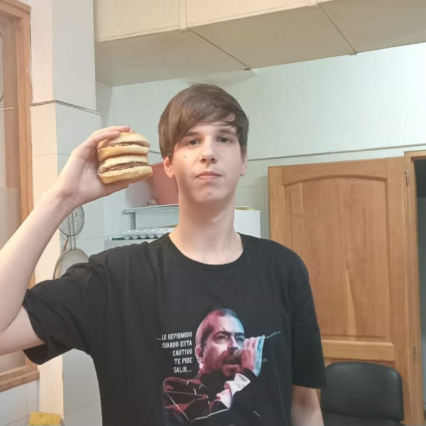

# 👨‍💻 Aucan Russo - 6to Año

¡Hola! Soy un estudiante de secundaria apasionado por la programación y la tecnología.  
Este espacio en GitHub lo utilizo para compartir mis proyectos, prácticas y aprendizajes.

---

## 🚀 Sobre mí
- 🎓 Actualmente curso el **6to año de secundaria en orientación Programación**.
- 💙 Soy de Argentina
- 💡 Me interesa el desarrollo de software, la lógica de programación y la resolución de problemas.
- 🌱 Estoy aprendiendo y mejorando en:
  - **Lenguajes:** Python, Java, JavaScript, C++
  - **Herramientas:** Git, GitHub, Visual Studio Code
  - **Conceptos:** Algoritmos, estructuras de datos, bases de datos

---

## 📂 Proyectos destacados
- 🖥️ **Mini juegos en Python**: proyectos simples para practicar lógica y estructuras.
- 🌐 **Página web personal**: HTML, CSS y JavaScript.
- 🔢 **Calculadora en Java**: aplicación de consola para operaciones básicas.

---

## 🎯 Objetivos
- Seguir aprendiendo nuevas tecnologías y frameworks.
- Mejorar mis habilidades en programación orientada a objetos.
- Contribuir a proyectos colaborativos y open source.

---

## 📫 Contacto
Si quieres conectar conmigo:  
- ✉️ Email: *aucannrusso2007@gmail.com*   

---

> *Este README es una presentación básica. A medida que avance en mis estudios y proyectos, lo iré actualizando para reflejar mi crecimiento como programador.*
